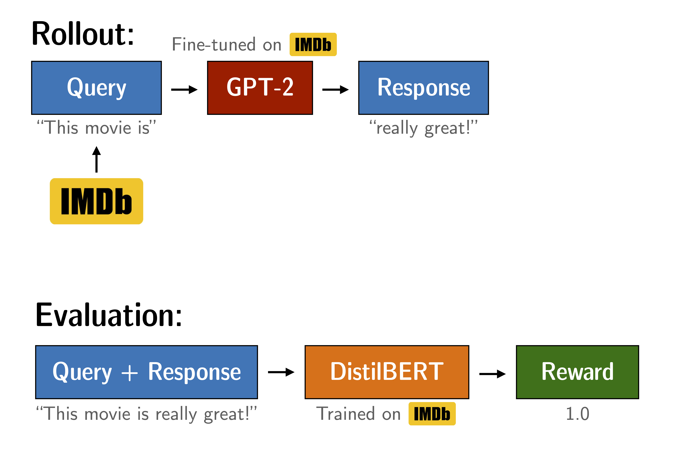

## Tune GPT2 to generate positive reviews

Optimise GPT2 to produce positive IMDB movie reviews using a BERT sentiment classifier as a reward function.

Figure: Experiment setup to tune GPT2. The yellow arrows are outside the scope of this notebook, but the trained models are available through Hugging Face.

In this notebook we fine-tune GPT2 (small) to generate positive movie reviews based on the IMDB dataset. The model gets the start of a real review and is tasked to produce positive continuations. To reward positive continuations we use a BERT classifier to analyse the sentiment of the produced sentences and use the classifier's outputs as rewards signals for PPO training.

## Getting started

Follow the steps below:

1. Create and activate a virtual env (from `movie-review-finetuning` directory)
```
python3 -m venv movie-rev-env
source movie-rev-env/bin/activate
```

2. Install required dependencies (from `movie-review-finetuning` directory)
```
pip3 install -r requirements.txt
```

3. Run the code as (from `movie-review-finetuning` directory):
```
python3 finetune_gpt2.py
```
